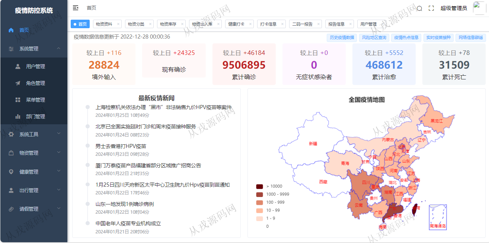
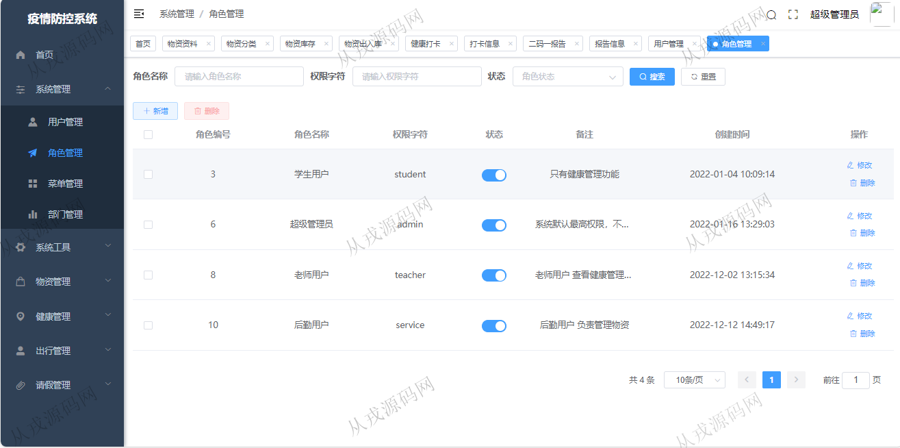
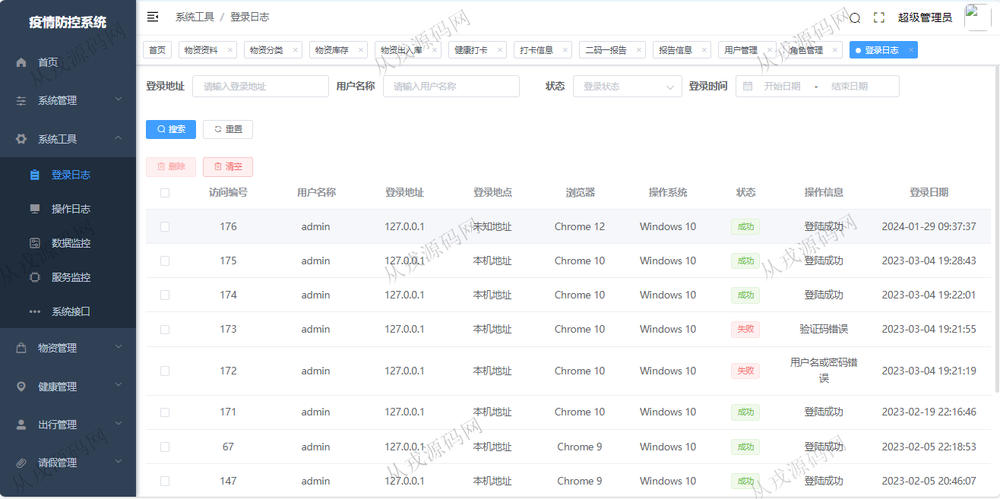
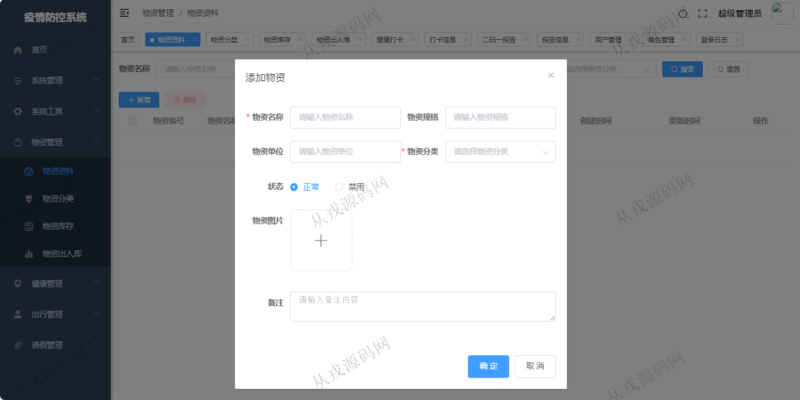
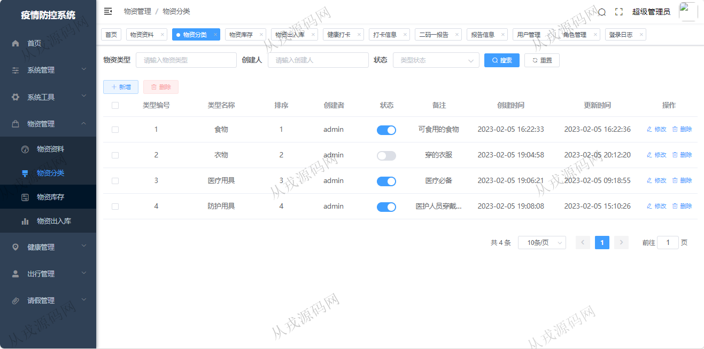
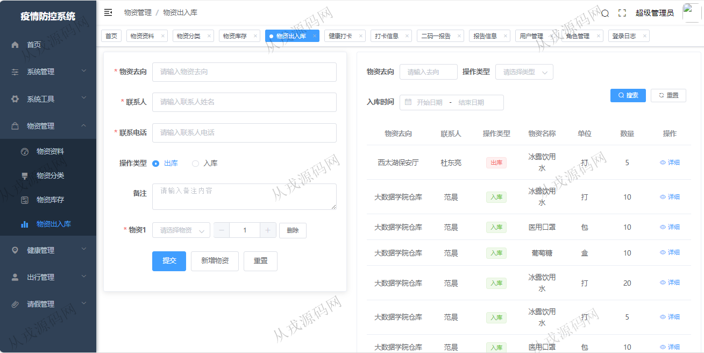
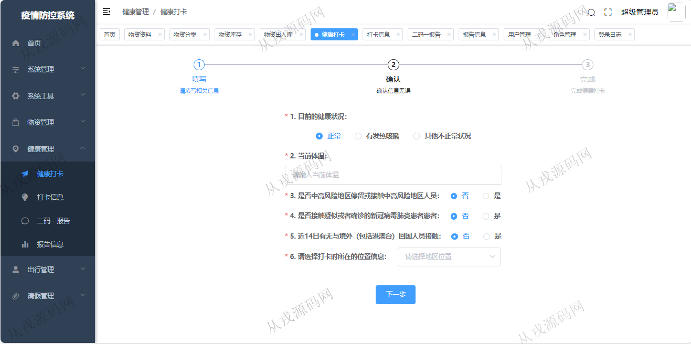
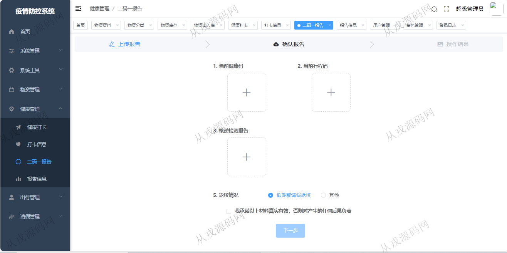
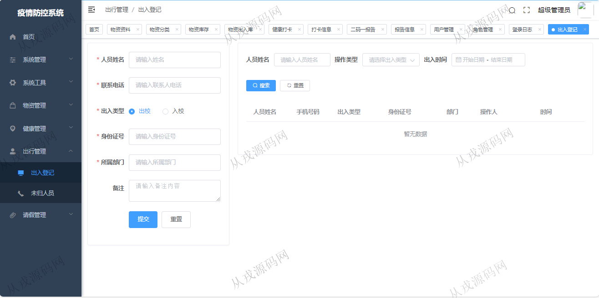

<h1 align="center">225.疫情防控管理系统</h1>

- <b>完整代码获取地址：从戎源码网 ([https://armycodes.com/](https://armycodes.com/))</b>
- <b>技术探讨、资料分享，请加QQ群：692619798</b> 
- <b>作者微信：19941326836  QQ：952045282</b> 
- <b>承接计算机毕业设计、Java毕业设计、Python毕业设计、深度学习、机器学习</b>
- <b>选题+开题报告+任务书+程序定制+安装调试+论文+答辩ppt 一条龙服务</b>
- <b>所有选题地址 ([https://github.com/YuLin-Coder/AllProjectCatalog](https://github.com/YuLin-Coder/AllProjectCatalog)) </b>

## 项目介绍
基于springboot+vue的疫情防控管理系统：前端 vue2、elementui，后端 maven、springmvc、spring、mybatis；角色分为管理员、用户；集成物资管理、健康管理、出行管理等功能于一体的系统。

## 功能介绍

- 系统管理：用户信息的增删改查，角色信息的增删改查，菜单信息的增删改查，部门信息的增删改查
- 物资管理：物资资料信息的增删改查，物资分类信息的增删改查，物资库存，物资出入库
- 健康管理：健康打卡，打卡信息查询，二码一报告，报告信息查询
- 出行管理：出入登记，未归登记
- 请假管理：请假申请，请假记录

## 环境

- <b>IntelliJ IDEA 2021.3</b>

- <b>Mysql 5.7.26</b>

- <b>node 14.14.0</b>

- <b>JDK 1.8</b>

## 运行截图

